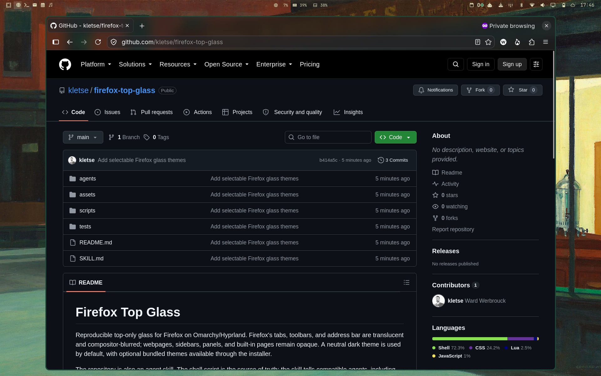

# Firefox Top Glass

Reproducible top-only glass for Firefox on Omarchy/Hyprland. Firefox's tabs,
toolbars, and address bar are translucent and compositor-blurred; webpages,
sidebars, panels, and built-in pages remain opaque. A neutral dark theme is
used by default, with optional bundled themes available through the installer.



The repository is also an agent skill. The shell script is the source of truth;
the skill tells compatible agents, including Codex, when and how to use it.

## Use

From this checkout:

```bash
./scripts/firefox-top-glass status
./scripts/firefox-top-glass install
./scripts/firefox-top-glass install --theme nighthawks
```

Fully close and reopen Firefox after installation. The script does not close
Firefox automatically.

Optional convenient links:

```bash
mkdir -p ~/.local/bin ~/.agents/skills
ln -s /path/to/firefox-top-glass/scripts/firefox-top-glass ~/.local/bin/firefox-top-glass
ln -s /path/to/firefox-top-glass ~/.agents/skills/firefox-top-glass
```

Then use `firefox-top-glass install` or ask a compatible agent to use
`$firefox-top-glass`. Codex also discovers skills installed in `~/.agents/skills`.

## Commands

```text
firefox-top-glass install [--theme NAME] [--profile PATH] [--no-reload]
firefox-top-glass status  [--profile PATH]
firefox-top-glass remove  [--profile PATH] [--no-reload]
```

The active Firefox profile is discovered from `installs.ini`, with
`profiles.ini` and conventional profile directories as fallbacks. Every changed
file receives a timestamped `.bak.*` copy. Managed marker blocks make installs
idempotent and preserve unrelated customizations.

`remove` deletes the managed blocks and stops enforcing the Firefox preferences.
Firefox may retain their last values in `prefs.js`; reset them in `about:config`
if complete preference restoration is required.

## Themes

`dark` is the default, so these commands are equivalent:

```bash
firefox-top-glass install
firefox-top-glass install --theme dark
```

The bundled themes are:

| Theme | Description |
| --- | --- |
| `dark` | Neutral dark colors with a conventional blue focus accent. |
| `nighthawks` | Warm text with deep green and brown accents. |

Theme files live in `assets/themes/` and contain only color variables. The
shared glass behavior and Firefox selectors remain in `assets/userChrome.css`,
so additional themes can be added without duplicating the implementation.
